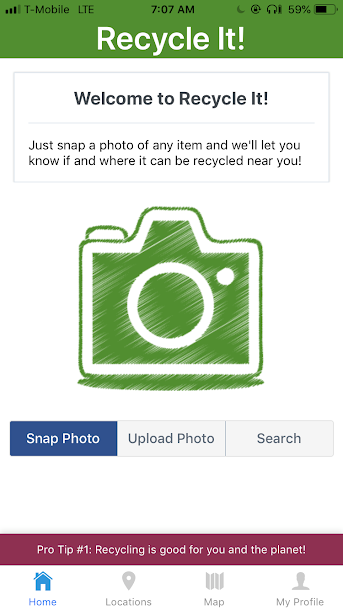
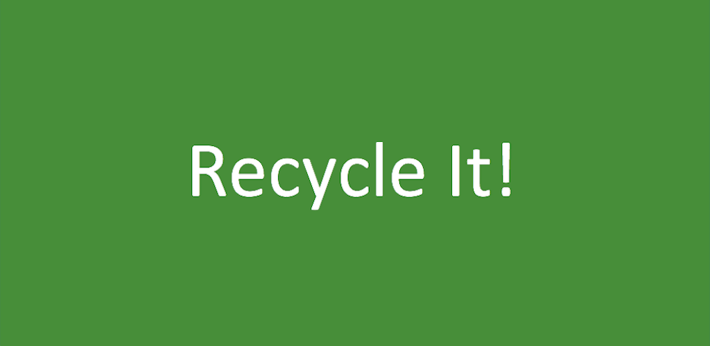

[](https://travis-ci.org/briantam23/Recycle)
[](https://app.snyk.io/test/github/briantam23/Recycle?targetFile=package.json)
[](https://david-dm.org/briantam23/Recycle)
[](https://david-dm.org/briantam23/Recycle?type=dev)

# ♻️ Recycling Image Recognition App

A Mobile App that: 

* Utilizes React Native / Redux along with the powerful Google Cloud Vision API in order to create a Mobile App that recognizes which items are recyclable using the mobile device's camera
* Integrates TypeScript & tests (using Jest) to significantly reduce errors
* Incorporates APIs such as Google Firebase, Google Maps, & Earth 911 and a UI Toolkit called React Native Elements

My team and I applied the popular Agile Scrum Methodology to deliver this MVP within a very small timebox.

 &emsp;  <hr/>


## Table of contents
* [Motivation](#motivation)
* [What is Google Cloud Vision?](#what-is-google-cloud-vision?)
* [Live Demo](#live-demo)
* [Dependencies](#dependencies)
* [Requirements](#requirements)
* [Installation](#installation)
* [Running Locally](#running-locally)
* [Tests](#tests)
* [Contributors](#contributors)

## Motivation
My team and I wanted to use the latest technologies such as Image Recognition, so when we were brainstorming ideas where it would be useful in our everyday lives, we came up with the excellent idea of using Image Recognition to determine whether items are recyclable or not. 

By having this convenience and fun factor, people would be more likely to use the app. Because without it, most people would tend not to make the effort to research the information and subsequently, throwing all items they’re not sure of, into the trash.

## What is Google Cloud Vision?
[Cloud Vision API](https://cloud.google.com/vision/docs/) allows developers to easily integrate vision detection features within applications, including image labeling, face and landmark detection, optical character recognition (OCR), and tagging of explicit content.

## Live Demo

Currently published to the [Play Store](https://play.google.com/store/apps/details?id=com.teamproton.recycleit) and coming soon to the App Store!

## Dependencies

* [React Native](https://facebook.github.io/react-native/)
* [Redux](https://redux.js.org)
* [Jest](https://jestjs.io/)
* [TypeScript](https://www.typescriptlang.org/)

## Requirements

* Device
    * iOS / Android smartphone or iOS / Android simulator
* Downloads
    * [Node.js (v10.16.0)](https://nodejs.org/en/)
    * [Git](https://git-scm.com/downloads)
    * [Expo CLI](https://docs.expo.io/versions/latest/workflow/expo-cli/)
* Environment Variables (must be set in `apiKey.js` or set as an environment variable)
    * [`CLOUD_VISION_API_KEY`](https://cloud.google.com/vision/docs/auth)
    * [`EARTH_911_API_KEY`](https://api.earth911.com/)
    * [`GOOGLE_MAPS_API_KEY`](https://cloud.google.com/maps-platform/)
    * [`FIREBASE_API_KEY`](https://firebase.google.com/docs/web/setup)

## Installation

Step 1: Clone Repo
```sh
git clone https://github.com/briantam23/Recycle.git` # or clone your own fork
```

Step 2: Install `node_modules`
```sh
npm install # or yarn install
```

## Running Locally

```sh
npm run start
```

The `npm run start` command will to start the local development server of Expo CLI.

Expo CLI starts Metro Bundler, which is an HTTP server that compiles the JavaScript code of our app using Babel and serves it to the Expo app. It also pops up Expo Dev Tools, a control panel for developing your app, in your default web browser.

To open the app in the iOS simulator you can press the i in the terminal or Run on iOS simulator in Dev Tools. To open the app in the Android emulator, first boot it up and then press a in the terminal or Run on Android device/emulator in Dev Tools.

Lastly, you will also see a QR code in terminal and Dev Tools. One fast way to open your project is to simply scan the QR code with the Expo client app on Android or using the built-in QR code scanner of the Camera app on iOS.

## Tests

```sh
npm run test
``` 

## Contributors

> [Brian Tam](https://github.com/briantam23) <br/>
> [Bobby Hirtle](https://github.com/protonbobby) <br/>
> [Stephanie Lieberman](https://github.com/slieberman1126) <br/>
> [Leovanny Fernandez](https://github.com/LeovannyF)