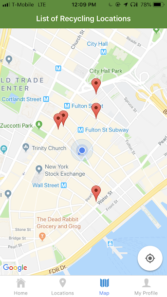

[](https://app.snyk.io/test/github/briantam23/Recycle?targetFile=package.json)
[](https://david-dm.org/briantam23/Recycle)
[](https://david-dm.org/briantam23/Recycle?type=dev)

# ♻️ Recycling Image Recognition App

 &emsp; 

A Mobile App that: 

* Utilizes React Native / Redux along with the powerful Google Cloud Vision API in order to create a Mobile App that recognizes which items are recyclable using the mobile device's camera
* Integrates TypeScript & tests (using Jest) to significantly reduce errors
* Incorporates APIs such as Google Firebase, Google Maps, & Earth 911 and a UI Toolkit called React Native Elements

My team and I applied the popular Agile Scrum Methodology to deliver this MVP within a very small timebox.


## Table of contents
* [Motivation](#motivation)
* [What is Google Cloud Vision?](#what-is-google-cloud-vision?)
* [Live Demo](#live-demo)
* [Dependencies](#dependencies)
* [Requirements](#requirements)
* [Installation](#installation)
* [Running Locally](#running-locally)
* [Tests](#tests)
* [Contact](#contact)

## Motivation
My team and I wanted to use the latest technologies such as Image Recognition, so when we were brainstorming ideas where it would be useful in our everyday lives, we came up with the excellent idea of using Image Recognition to determine whether items are recyclable or not. 

By having this convenience and fun factor, people would be more likely to use the app. Because without it, most people would tend not to make the effort to research the information and subsequently, throwing all items they’re not sure of, into the trash.

## What is Google Cloud Vision?
[Cloud Vision API](https://cloud.google.com/vision/docs/) allows developers to easily integrate vision detection features within applications, including image labeling, face and landmark detection, optical character recognition (OCR), and tagging of explicit content.

## Live Demo

Currently published to the [Play Store](https://play.google.com/store/apps/details?id=com.teamproton.recycleit) and coming soon to the App Store!

## Dependencies

* [React Native](https://facebook.github.io/react-native/)
* [Redux](https://redux.js.org)
* [Jest](https://jestjs.io/)
* [TypeScript](https://www.typescriptlang.org/)

## Requirements

* Downloads
    * [Node.js (v10.16.0)](https://nodejs.org/en/)
    * [Git](https://git-scm.com/downloads)
* Environment Variables (must be set in `apiKey.js` or set as an environment variable)
    * [`CLOUD_VISION_API_KEY`](https://cloud.google.com/vision/docs/auth)
    * [`EARTH_911_API_KEY`](https://api.earth911.com/)
    * [`GOOGLE_MAPS_API_KEY`](https://cloud.google.com/maps-platform/)
    * [`FIREBASE_API_KEY`](https://firebase.google.com/docs/web/setup)

## Installation

Step 1: Clone Repo
```sh
git clone https://github.com/briantam23/Recycle.git` # or clone your own fork
```

Step 2: Install `node_modules`
```sh
npm install # or yarn install
```

## Running Locally

```sh
npm run start
```

## Tests

```sh
npm run test
``` 

## Contact
Created by [Brian Tam](http://briantam23.github.io) - feel free to contact me at [briantam23@gmail.com](mailto:briantam23@gmail.com)!

Personal Website - [briantam23.github.io](http://briantam23.github.io) <br/>
LinkedIn - [@briantam23](https://linkedin.com/in/briantam23/) <br/>
Github - [@briantam23](https://github.com/briantam23)